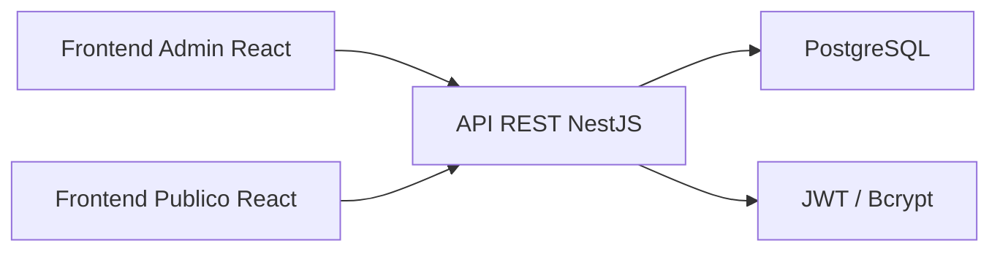
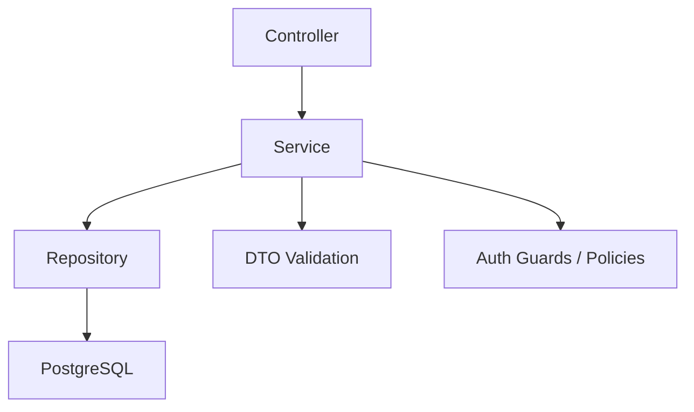
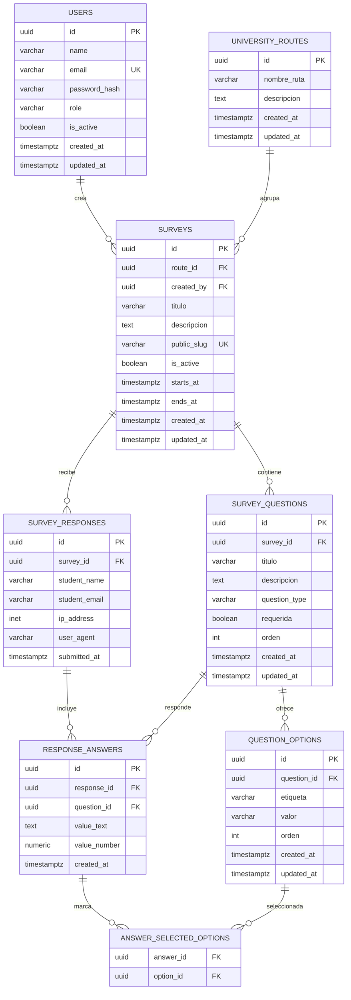

## 1. Diseno de Arquitectura


## 2. Descripcion de Tecnologia
- Frontend admin: React 18 + Vite + TailwindCSS + React Router + TanStack Query + React Hook Form + Zod + Recharts
- Frontend publico: React 18 reutilizando el mismo proyecto con rutas publicas desacopladas del layout privado
- Backend: NestJS + TypeORM + class-validator + Passport JWT + bcrypt
- Base de datos: PostgreSQL 16
- Inicializacion del repositorio: monorepo con `apps/admin-web` y `apps/api`

## 3. Estructura Inicial del Proyecto
```text
Encuestas Universitarias/
├── apps/
│   ├── admin-web/
│   │   ├── src/
│   │   │   ├── app/
│   │   │   │   ├── router/
│   │   │   │   ├── providers/
│   │   │   │   └── layouts/
│   │   │   ├── features/
│   │   │   │   ├── auth/
│   │   │   │   ├── users/
│   │   │   │   ├── routes/
│   │   │   │   ├── surveys/
│   │   │   │   └── analytics/
│   │   │   ├── components/
│   │   │   ├── lib/
│   │   │   └── styles/
│   │   └── public/
│   └── api/
│       ├── src/
│       │   ├── modules/
│       │   │   ├── auth/
│       │   │   ├── users/
│       │   │   ├── university-routes/
│       │   │   ├── surveys/
│       │   │   ├── survey-questions/
│       │   │   ├── survey-responses/
│       │   │   └── dashboard/
│       │   ├── common/
│       │   ├── config/
│       │   └── database/
│       └── test/
├── packages/
│   ├── shared-types/
│   └── eslint-config/
├── .trae/
│   └── documents/
└── README.md
```

## 4. Definicion de Rutas
| Ruta | Proposito |
|------|-----------|
| /login | Inicio de sesion administrativo |
| /dashboard | Resumen general del sistema |
| /usuarios | Gestion de usuarios |
| /rutas | CRUD de rutas universitarias |
| /encuestas | Listado y administracion de encuestas |
| /encuestas/nueva | Creacion de encuesta |
| /encuestas/:surveyId/editar | Edicion de encuesta |
| /resultados | Analitica y respuestas |
| /encuesta/:publicSlug | Vista publica de encuesta |

## 5. Definiciones de API
```ts
type UserRole = 'ADMIN' | 'OPERATOR';
type QuestionType = 'SHORT_TEXT' | 'LONG_TEXT' | 'SINGLE_CHOICE' | 'MULTIPLE_CHOICE' | 'NUMBER' | 'RATING';

interface AuthLoginRequest {
  email: string;
  password: string;
}

interface AuthLoginResponse {
  accessToken: string;
  user: {
    id: string;
    name: string;
    email: string;
    role: UserRole;
  };
}

interface CreateUniversityRouteRequest {
  nombreRuta: string;
  descripcion?: string;
}

interface CreateSurveyRequest {
  routeId: string;
  titulo: string;
  descripcion?: string;
  isActive: boolean;
  questions: Array<{
    titulo: string;
    descripcion?: string;
    tipo: QuestionType;
    requerida: boolean;
    orden: number;
    options?: Array<{
      etiqueta: string;
      valor: string;
      orden: number;
    }>;
  }>;
}

interface SubmitSurveyResponseRequest {
  studentName?: string;
  studentEmail?: string;
  answers: Array<{
    questionId: string;
    valueText?: string;
    valueNumber?: number;
    selectedOptionIds?: string[];
  }>;
}
```

### 5.1 Endpoints Principales
| Metodo | Endpoint | Descripcion |
|--------|----------|-------------|
| POST | /auth/login | Inicia sesion y devuelve JWT |
| GET | /users | Lista usuarios |
| POST | /users | Crea usuario |
| PATCH | /users/:id | Edita nombre, correo, rol o estado |
| PATCH | /users/:id/password | Cambia contrasena directamente |
| GET | /university-routes | Lista rutas |
| POST | /university-routes | Crea ruta |
| PATCH | /university-routes/:id | Actualiza ruta |
| DELETE | /university-routes/:id | Elimina ruta |
| GET | /surveys | Lista encuestas con filtros |
| POST | /surveys | Crea encuesta con preguntas |
| GET | /surveys/:id | Obtiene detalle administrativo |
| PATCH | /surveys/:id | Actualiza encuesta |
| PATCH | /surveys/:id/status | Activa o desactiva encuesta |
| DELETE | /surveys/:id | Elimina encuesta |
| GET | /public/surveys/:publicSlug | Obtiene encuesta publica activa |
| POST | /public/surveys/:publicSlug/responses | Registra respuestas publicas |
| GET | /dashboard/surveys/:id/results | Devuelve estadisticas y registros |

## 6. Diagrama de Arquitectura del Servidor


## 7. Modelo de Datos
### 7.1 Definicion del Modelo


### 7.2 DDL Inicial de PostgreSQL
```sql
CREATE EXTENSION IF NOT EXISTS "pgcrypto";

DO $$
BEGIN
  IF NOT EXISTS (SELECT 1 FROM pg_type WHERE typname = 'user_role') THEN
    CREATE TYPE user_role AS ENUM ('ADMIN', 'OPERATOR');
  END IF;
  IF NOT EXISTS (SELECT 1 FROM pg_type WHERE typname = 'question_type') THEN
    CREATE TYPE question_type AS ENUM (
      'SHORT_TEXT',
      'LONG_TEXT',
      'SINGLE_CHOICE',
      'MULTIPLE_CHOICE',
      'NUMBER',
      'RATING'
    );
  END IF;
END $$;

CREATE TABLE users (
  id UUID PRIMARY KEY DEFAULT gen_random_uuid(),
  name VARCHAR(120) NOT NULL,
  email VARCHAR(160) NOT NULL UNIQUE,
  password_hash VARCHAR(255) NOT NULL,
  role user_role NOT NULL DEFAULT 'OPERATOR',
  is_active BOOLEAN NOT NULL DEFAULT TRUE,
  created_at TIMESTAMPTZ NOT NULL DEFAULT NOW(),
  updated_at TIMESTAMPTZ NOT NULL DEFAULT NOW()
);

CREATE TABLE university_routes (
  id UUID PRIMARY KEY DEFAULT gen_random_uuid(),
  nombre_ruta VARCHAR(120) NOT NULL,
  descripcion TEXT,
  created_at TIMESTAMPTZ NOT NULL DEFAULT NOW(),
  updated_at TIMESTAMPTZ NOT NULL DEFAULT NOW()
);

CREATE TABLE surveys (
  id UUID PRIMARY KEY DEFAULT gen_random_uuid(),
  route_id UUID NOT NULL REFERENCES university_routes(id) ON DELETE RESTRICT,
  created_by UUID NOT NULL REFERENCES users(id) ON DELETE RESTRICT,
  titulo VARCHAR(180) NOT NULL,
  descripcion TEXT,
  public_slug VARCHAR(180) NOT NULL UNIQUE,
  is_active BOOLEAN NOT NULL DEFAULT FALSE,
  starts_at TIMESTAMPTZ,
  ends_at TIMESTAMPTZ,
  created_at TIMESTAMPTZ NOT NULL DEFAULT NOW(),
  updated_at TIMESTAMPTZ NOT NULL DEFAULT NOW()
);

CREATE TABLE survey_questions (
  id UUID PRIMARY KEY DEFAULT gen_random_uuid(),
  survey_id UUID NOT NULL REFERENCES surveys(id) ON DELETE CASCADE,
  titulo VARCHAR(200) NOT NULL,
  descripcion TEXT,
  question_type question_type NOT NULL,
  requerida BOOLEAN NOT NULL DEFAULT TRUE,
  orden INT NOT NULL,
  created_at TIMESTAMPTZ NOT NULL DEFAULT NOW(),
  updated_at TIMESTAMPTZ NOT NULL DEFAULT NOW(),
  CONSTRAINT uq_survey_question_order UNIQUE (survey_id, orden)
);

CREATE TABLE question_options (
  id UUID PRIMARY KEY DEFAULT gen_random_uuid(),
  question_id UUID NOT NULL REFERENCES survey_questions(id) ON DELETE CASCADE,
  etiqueta VARCHAR(160) NOT NULL,
  valor VARCHAR(160) NOT NULL,
  orden INT NOT NULL,
  created_at TIMESTAMPTZ NOT NULL DEFAULT NOW(),
  updated_at TIMESTAMPTZ NOT NULL DEFAULT NOW(),
  CONSTRAINT uq_question_option_order UNIQUE (question_id, orden)
);

CREATE TABLE survey_responses (
  id UUID PRIMARY KEY DEFAULT gen_random_uuid(),
  survey_id UUID NOT NULL REFERENCES surveys(id) ON DELETE CASCADE,
  student_name VARCHAR(160),
  student_email VARCHAR(160),
  ip_address INET,
  user_agent VARCHAR(512),
  submitted_at TIMESTAMPTZ NOT NULL DEFAULT NOW()
);

CREATE TABLE response_answers (
  id UUID PRIMARY KEY DEFAULT gen_random_uuid(),
  response_id UUID NOT NULL REFERENCES survey_responses(id) ON DELETE CASCADE,
  question_id UUID NOT NULL REFERENCES survey_questions(id) ON DELETE CASCADE,
  value_text TEXT,
  value_number NUMERIC(10,2),
  created_at TIMESTAMPTZ NOT NULL DEFAULT NOW()
);

CREATE TABLE answer_selected_options (
  answer_id UUID NOT NULL REFERENCES response_answers(id) ON DELETE CASCADE,
  option_id UUID NOT NULL REFERENCES question_options(id) ON DELETE CASCADE,
  PRIMARY KEY (answer_id, option_id)
);

CREATE INDEX idx_surveys_route_id ON surveys(route_id);
CREATE INDEX idx_surveys_public_slug ON surveys(public_slug);
CREATE INDEX idx_questions_survey_id ON survey_questions(survey_id);
CREATE INDEX idx_options_question_id ON question_options(question_id);
CREATE INDEX idx_responses_survey_id ON survey_responses(survey_id);
CREATE INDEX idx_answers_response_id ON response_answers(response_id);
CREATE INDEX idx_answers_question_id ON response_answers(question_id);
```

## 8. Decisiones Iniciales
- Se evita registro publico y la creacion de usuarios queda solo en panel administrativo.
- Se utiliza `public_slug` en lugar de exponer ids secuenciales en las URL publicas.
- Las respuestas se normalizan en `response_answers` para soportar preguntas abiertas, numericas y de seleccion multiple.
- El dashboard se alimenta desde agregaciones por encuesta y por pregunta para facilitar graficas con Recharts.
