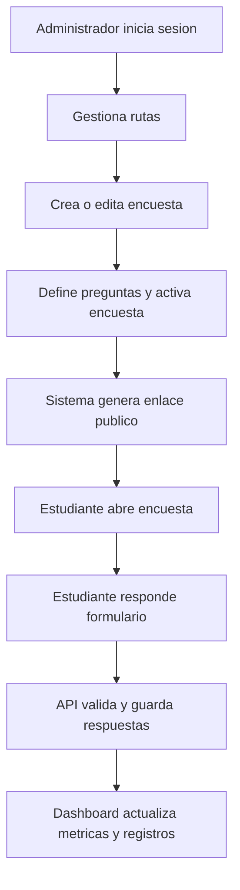

## 1. Descripcion General del Producto

Plataforma web para administrar encuestas de rutas universitarias y recolectar respuestas publicas desde enlaces unicos por encuesta.

* Resuelve la gestion centralizada de usuarios, rutas, formularios y analitica para evaluar satisfaccion, tiempos de espera y ocupacion.

* Aporta valor institucional al convertir respuestas dispersas en informacion accionable para ajustar recorridos y calidad del servicio.

## 2. Funcionalidades Principales

### 2.1 Roles de Usuario

| Rol           | Metodo de acceso              | Permisos principales                                                     |
| ------------- | ----------------------------- | ------------------------------------------------------------------------ |
| Administrador | Login por correo y contrasena | Gestionar usuarios, rutas, encuestas, respuestas y dashboard             |
| Operador      | Login por correo y contrasena | Gestionar rutas, encuestas y revisar resultados segun permisos asignados |
| Estudiante    | Enlace publico de encuesta    | Responder encuestas activas sin autenticacion                            |

### 2.2 Modulos del Producto

1. **Login administrativo**: acceso seguro con JWT, cierre de sesion y proteccion de rutas privadas.
2. **Gestion de usuarios**: crear usuarios, listar, editar rol, desactivar y cambiar contrasenas sin registro publico.
3. **Gestion de rutas universitarias**: CRUD de rutas con nombre y descripcion.
4. **Gestion de encuestas**: CRUD de encuestas por ruta, constructor de preguntas y activacion/desactivacion.
5. **Encuesta publica**: formulario responsive con informacion de ruta y envio de respuestas.
6. **Dashboard de resultados**: visualizacion tabular y grafica por encuesta, pregunta y ruta.

### 2.3 Detalle de Paginas

| Nombre de pagina | Modulo         | Descripcion funcional                                                                     |
| ---------------- | -------------- | ----------------------------------------------------------------------------------------- |
| Login            | Autenticacion  | Permite acceso por correo y contrasena, valida credenciales y persiste sesion JWT         |
| Dashboard        | Resumen        | Muestra metricas clave, encuestas activas, respuestas recientes y accesos rapidos         |
| Usuarios         | Administracion | Alta de usuarios, edicion de rol, activacion/desactivacion y cambio directo de contrasena |
| Rutas            | Catalogo       | CRUD de rutas universitarias con nombre y descripcion                                     |
| Encuestas        | Formularios    | Creacion y edicion de encuestas, constructor de preguntas, estado activo y enlace publico |
| Resultados       | Analitica      | Graficas por pregunta, filtros por ruta/encuesta y tabla de respuestas individuales       |
| Encuesta publica | Captura        | Presenta informacion de la ruta, preguntas dinamicas y confirmacion de envio              |

## 3. Flujo Principal

El administrador inicia sesion, crea rutas y luego configura encuestas asociadas a cada ruta. Cada encuesta genera un enlace publico unico que se comparte con estudiantes. Los estudiantes responden el formulario desde el movil y las respuestas se almacenan para su analisis posterior en el panel.

## 4. Diseno de Interfaz

### 4.1 Estilo Visual

* Colores principales: azul marino institucional, verde acento para estados correctos y gris claro para superficies.

* Estilo de botones: redondeado medio, alto contraste y estados hover discretos.

* Tipografia: sans serif moderna para legibilidad administrativa y tamanos generosos en vista movil.

* Estilo de layout: panel administrativo con barra lateral y contenido principal en tarjetas; vista publica centrada y orientada a formularios.

* Iconografia: iconos lineales sobrios para navegacion, estados y acciones CRUD.

### 4.2 Resumen de Diseno por Pagina

| Nombre de pagina | Modulo                | Elementos de interfaz                                                                    |
| ---------------- | --------------------- | ---------------------------------------------------------------------------------------- |
| Login            | Formulario            | Tarjeta centrada, campos claros, mensajes de error y branding institucional              |
| Dashboard        | Indicadores           | Tarjetas KPI, graficas de barras/pastel, tabla de actividad reciente                     |
| Usuarios         | Tabla y formulario    | Tabla filtrable, modal o panel lateral para alta/edicion, acciones protegidas            |
| Rutas            | CRUD simple           | Tabla, formulario en modal y confirmacion para eliminar                                  |
| Encuestas        | Constructor           | Secciones expandibles para datos base, preguntas dinamicas y previsualizacion del enlace |
| Resultados       | Analitica             | Filtros, graficas por pregunta y tabla exportable de respuestas                          |
| Encuesta publica | Formulario responsive | Tarjeta de una columna, preguntas por bloques y boton fijo de envio en movil             |

### 4.3 Responsividad

* Enfoque desktop-first para panel administrativo con adaptacion a tablet.

* Vista publica optimizada para movil con formularios tactiles, espaciado amplio y validaciones visibles.

* Graficas y tablas deben degradarse a tarjetas o scroll horizontal controlado en pantallas pequenas.

